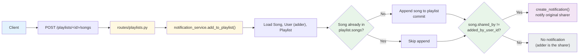

# Mixtape Bug Hunt — Submission

## AI Usage

<!-- Fill this in at the end (Milestone 4). Be specific: what you asked,
what the AI helped explain/trace, and at least one place where you had
to verify or correct something the AI said. -->

TODO

---

## Codebase Map

### Main files and their roles

- **`app.py`** — Flask application factory. Initializes SQLAlchemy (`db`),
  registers four blueprints (`songs_bp` at `/songs`, `playlists_bp` at
  `/playlists`, `users_bp` at `/users`, `feed_bp` at `/feed`), and creates
  all tables on startup.
- **`models.py`** — Defines 7 SQLAlchemy models: `User`, `Song`, `Tag`,
  `Playlist`, `Rating`, `Notification`, `ListeningEvent`. Three association
  tables handle many-to-many relationships: `friendships` (symmetric
  user-to-user), `song_tags` (song-to-tag), and `playlist_entries`
  (playlist-to-song, which additionally carries `position`, `added_by`,
  and `added_at` — it's not a plain join table).
- **`routes/`** — Thin layer that parses requests and delegates to
  `services/`. `songs.py` handles search/rate/listen, `playlists.py`
  handles playlist creation and song management, `users.py` handles
  profile/streak/notifications, `feed.py` handles the friends feed.
- **`services/streak_service.py`** — Computes a user's listening streak.
  A streak increments on consecutive calendar days, resets to 1 if a day
  is skipped. Core logic lives in `update_listening_streak()`.
- **`services/feed_service.py`** — Two functions: `get_friends_listening_now()`
  (filters to events within `RECENT_THRESHOLD` = 24h, deduplicated to one
  song per friend) and `get_activity_feed()` (last N events, no recency
  filter).
- **`services/search_service.py`** — Searches songs by title/artist
  (case-insensitive `ilike`), joined with the `song_tags` table to
  include tags in the result.
- **`services/notification_service.py`** — Creates and retrieves
  notifications. `add_to_playlist()` adds a song to a playlist and
  notifies the original sharer. `rate_song()` saves a rating.
- **`services/playlist_service.py`** — Retrieves playlist metadata and
  ordered song lists.

### Data flow — adding a song to a playlist

**Summary:** Adding a song to a playlist always appends it to `playlist.songs`
if it isn't already there, but a notification is only created for the
song's original sharer — and only if the person adding it isn't that same
sharer. This is the working notification path referenced in Issue #4,
which is useful to compare against the missing `rate_song()` notification.

### Pattern noticed

Every route delegates immediately to a function in `services/`; routes
only handle request parsing and response formatting. Business logic and
DB queries live entirely in the service layer, which is also where all
five known bugs live.

---

## Root Cause Analysis

### Issue #1: My listening streak keeps resetting

**How I reproduced it:**

Using `flask shell`, I called `update_listening_streak()` directly with
controlled `datetime` values to simulate 3 consecutive days of listening
(Saturday July 4 -> Sunday July 5 -> Monday July 6, all UTC):

- Day 1 (Saturday, `weekday()`=5): streak went 0 -> 1 (expected — first
  listening event).
- Day 2 (Sunday, `weekday()`=6): streak stayed at 1 instead of
  incrementing to 2.
- Day 3 (Monday, `weekday()`=0): streak went to 2 instead of 3, because
  Day 2 had incorrectly reset instead of incrementing.

This confirms the streak breaks specifically when the day being recorded
is a Sunday, even though the user listened on consecutive calendar days.

**How I found the root cause:**

I traced `update_listening_streak()` in `streak_service.py` line by line
using the values printed during reproduction. With `days_since_last == 1`
between Saturday and Sunday, I checked the `elif` condition manually:
`today.weekday() != 6` evaluates to `6 != 6`, which is `False`, since
Python's `date.weekday()` returns 6 for Sunday. Because the `elif`
condition as a whole (`True and False`) is `False`, execution falls
through to the `else` branch, which resets the streak to 1 instead of
incrementing it. This confirmed the exact line responsible, rather than
just "somewhere in the streak logic."

**The root cause:**

The `elif` condition `days_since_last == 1 and today.weekday() != 6` was
intended to increment the streak on any consecutive day, but the added
`today.weekday() != 6` clause excludes Sundays specifically — Python's
`date.weekday()` returns 6 for Sunday. So whenever a user's *current*
listening event falls on a Sunday (regardless of whether the previous
day was covered), the condition evaluates to `False` and execution falls
into the `else` branch, which unconditionally resets the streak to 1.
This is why a user listening on consecutive days, where one of those
days happens to be a Sunday, sees their streak reset instead of
increment.

**My fix and side-effect check:**

**My fix and side-effect check:**

I removed the `and today.weekday() != 6` clause from the `elif` condition
in `update_listening_streak()`, so it now reads simply
`elif days_since_last == 1:`. This clause had no basis in the documented
streak rules and was the sole cause of the Sunday reset.

I re-ran the original reproduction (Saturday -> Sunday -> Monday) and
confirmed the streak now increments correctly: 1 -> 2 -> 3, instead of
resetting on Sunday.

To check I hadn't broken the other two documented rules, I tested both
remaining cases directly via `update_listening_streak()`:
- Two listens on the same calendar day: streak stayed at 5 (unchanged),
  confirming the `days_since_last == 0` branch still works correctly.
- A 3-day gap since the last listen: streak reset to 1, confirming the
  `else` branch (skipped day handling) is unaffected.

Both cases behaved as expected, so the fix only changes behavior for the
specific Sunday case it was meant to address.

---

### Issue #2: Friends Listening Now shows people from yesterday

**How I reproduced it:**

TODO — fill in after running the `flask shell` steps for feed_service.

**How I found the root cause:**

TODO

**The root cause:**

TODO

**My fix and side-effect check:**

TODO

---

### Issue #3: The same song keeps showing up twice in search

**How I reproduced it:**

TODO — fill in after running the `flask shell` steps for search_service.

**How I found the root cause:**

TODO

**The root cause:**

TODO

**My fix and side-effect check:**

TODO