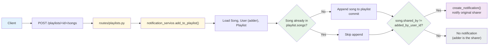
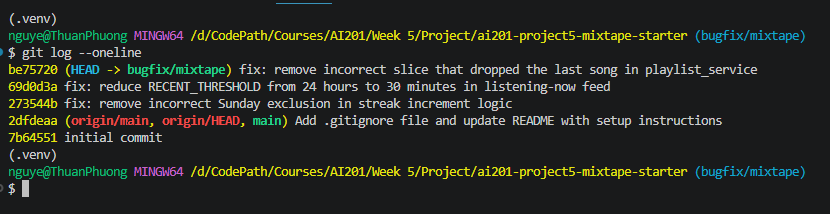

# Mixtape Bug Hunt — Submission

## AI Usage

I used AI throughout this project primarily for code navigation, tracing
execution flow, and verifying hypotheses about root causes — not for
generating fixes directly.

- For codebase orientation, I shared each service file and asked the AI
  to summarize what it was responsible for and trace how a song added
  to a playlist triggers a notification, which became the data flow
  example in my codebase map.
- For Issue #1, the AI helped me manually trace how `today.weekday()`
  evaluates on a Sunday and why that made the `elif` condition false,
  after I had already identified the suspicious line myself.
- For Issue #2, the AI's first hypothesis (a timezone string-format
  mismatch between SQLite storage and the `cutoff` value) turned out to
  be a dead end — I tested it directly with compiled SQL and boundary
  cases and disproved it myself. This led us back to re-reading
  `seed_data.py`, where a comment revealed the actual root cause was
  the `RECENT_THRESHOLD` value being too large, not the comparison logic.
- For Issue #3 (duplicate songs in search), the AI's initial hypothesis
  about SQLAlchemy JOIN duplication was tested extensively (via shell,
  HTTP requests, and the repo's own pytest suite) but never reproduced —
  all 5 existing tests passed, including the one specifically checking
  for this bug. We documented this as an unreproducible case and moved
  to Issue #5 instead of forcing a fix for a bug that didn't manifest.
- For Issue #5, I identified the suspicious `songs[:-1]` slice myself by
  reading `playlist_service.py`; the AI helped me design the isolated
  single-song-playlist test that confirmed the bug's most extreme case
  (an empty return for a playlist with just one song).

Overall, the AI was most useful for structuring reproduction tests and
explaining Python/SQLAlchemy behavior I was unsure about, but several of
its initial hypotheses (Issue #2's timezone theory, Issue #3's JOIN
theory) were wrong and required me to verify with actual test output
before accepting or rejecting them.

---

## Codebase Map

### Main files and their roles

- **`app.py`** — Flask application factory. Initializes SQLAlchemy (`db`),
  registers four blueprints (`songs_bp` at `/songs`, `playlists_bp` at
  `/playlists`, `users_bp` at `/users`, `feed_bp` at `/feed`), and creates
  all tables on startup.
- **`models.py`** — Defines 7 SQLAlchemy models: `User`, `Song`, `Tag`,
  `Playlist`, `Rating`, `Notification`, `ListeningEvent`. Three association
  tables handle many-to-many relationships: `friendships` (symmetric
  user-to-user), `song_tags` (song-to-tag), and `playlist_entries`
  (playlist-to-song, which additionally carries `position`, `added_by`,
  and `added_at` — it's not a plain join table).
- **`routes/`** — Thin layer that parses requests and delegates to
  `services/`. `songs.py` handles search/rate/listen, `playlists.py`
  handles playlist creation and song management, `users.py` handles
  profile/streak/notifications, `feed.py` handles the friends feed.
- **`services/streak_service.py`** — Computes a user's listening streak.
  A streak increments on consecutive calendar days, resets to 1 if a day
  is skipped. Core logic lives in `update_listening_streak()`.
- **`services/feed_service.py`** — Two functions: `get_friends_listening_now()`
  (filters to events within `RECENT_THRESHOLD` = 24h, deduplicated to one
  song per friend) and `get_activity_feed()` (last N events, no recency
  filter).
- **`services/search_service.py`** — Searches songs by title/artist
  (case-insensitive `ilike`), joined with the `song_tags` table to
  include tags in the result.
- **`services/notification_service.py`** — Creates and retrieves
  notifications. `add_to_playlist()` adds a song to a playlist and
  notifies the original sharer. `rate_song()` saves a rating.
- **`services/playlist_service.py`** — Retrieves playlist metadata and
  ordered song lists.

### Data flow — adding a song to a playlist

**Summary:** Adding a song to a playlist always appends it to `playlist.songs`
if it isn't already there, but a notification is only created for the
song's original sharer — and only if the person adding it isn't that same
sharer. This is the working notification path referenced in Issue #4,
which is useful to compare against the missing `rate_song()` notification.

### Pattern noticed

Every route delegates immediately to a function in `services/`; routes
only handle request parsing and response formatting. Business logic and
DB queries live entirely in the service layer, which is also where all
five known bugs live.

---

## Root Cause Analysis

### Issue #1: My listening streak keeps resetting

**How I reproduced it:**

Using `flask shell`, I called `update_listening_streak()` directly with
controlled `datetime` values to simulate 3 consecutive days of listening
(Saturday July 4 -> Sunday July 5 -> Monday July 6, all UTC):

- Day 1 (Saturday, `weekday()`=5): streak went 0 -> 1 (expected — first
  listening event).
- Day 2 (Sunday, `weekday()`=6): streak stayed at 1 instead of
  incrementing to 2.
- Day 3 (Monday, `weekday()`=0): streak went to 2 instead of 3, because
  Day 2 had incorrectly reset instead of incrementing.

This confirms the streak breaks specifically when the day being recorded
is a Sunday, even though the user listened on consecutive calendar days.

**How I found the root cause:**

I traced `update_listening_streak()` in `streak_service.py` line by line
using the values printed during reproduction. With `days_since_last == 1`
between Saturday and Sunday, I checked the `elif` condition manually:
`today.weekday() != 6` evaluates to `6 != 6`, which is `False`, since
Python's `date.weekday()` returns 6 for Sunday. Because the `elif`
condition as a whole (`True and False`) is `False`, execution falls
through to the `else` branch, which resets the streak to 1 instead of
incrementing it. This confirmed the exact line responsible, rather than
just "somewhere in the streak logic."

**The root cause:**

The `elif` condition `days_since_last == 1 and today.weekday() != 6` was
intended to increment the streak on any consecutive day, but the added
`today.weekday() != 6` clause excludes Sundays specifically — Python's
`date.weekday()` returns 6 for Sunday. So whenever a user's *current*
listening event falls on a Sunday (regardless of whether the previous
day was covered), the condition evaluates to `False` and execution falls
into the `else` branch, which unconditionally resets the streak to 1.
This is why a user listening on consecutive days, where one of those
days happens to be a Sunday, sees their streak reset instead of
increment.

**My fix and side-effect check:**

**My fix and side-effect check:**

I removed the `and today.weekday() != 6` clause from the `elif` condition
in `update_listening_streak()`, so it now reads simply
`elif days_since_last == 1:`. This clause had no basis in the documented
streak rules and was the sole cause of the Sunday reset.

I re-ran the original reproduction (Saturday -> Sunday -> Monday) and
confirmed the streak now increments correctly: 1 -> 2 -> 3, instead of
resetting on Sunday.

To check I hadn't broken the other two documented rules, I tested both
remaining cases directly via `update_listening_streak()`:
- Two listens on the same calendar day: streak stayed at 5 (unchanged),
  confirming the `days_since_last == 0` branch still works correctly.
- A 3-day gap since the last listen: streak reset to 1, confirming the
  `else` branch (skipped day handling) is unaffected.

Both cases behaved as expected, so the fix only changes behavior for the
specific Sunday case it was meant to address.

---

### Issue #2: Friends Listening Now shows people from yesterday

**How I reproduced it:**

I queried `get_friends_listening_now()` directly in `flask shell` for
each seeded user as viewer, and computed the actual age of each returned
event. For example, viewing as `kenji`, the feed included `nova` with an
event 3.6 hours old. Since "Listening Now" implies the friend is
currently listening, an event several hours old being shown as "now" is
the reported bug. I confirmed this wasn't a one-off by checking multiple
viewers (`darius`, `simone`, `aaliya`) — all consistently showed friends
with events 1.8–3.6 hours old as "listening now."

**How I found the root cause:**

I first suspected a timezone/string-comparison issue between the naive
datetimes stored in SQLite and the timezone-aware `cutoff` value used in
the filter, since SQLite stores datetimes as text and compares them as
strings. I compiled the actual SQL query with literal binds and found
the stored values and the `cutoff` value did have different string
formats (the cutoff included a `+00:00` suffix, stored rows did not).
However, testing this directly — including edge cases at 23:59 and
24:01 hours — showed the filter behaved correctly regardless, so the
format mismatch was a red herring and not the actual cause.

Re-reading `seed_data.py`, a comment on the older listening events read
"should NOT appear in 'listening now' after fix" — which pointed me back
to `RECENT_THRESHOLD` itself rather than the comparison logic. I
confirmed this by temporarily overriding `RECENT_THRESHOLD` to 30 minutes
in the shell and re-querying: friends with events older than 30 minutes
(like `nova` at 3.6h) disappeared from the results, confirming the
constant's value — not the filtering logic — was the problem.

**The root cause:**

`RECENT_THRESHOLD = timedelta(hours=24)` in `feed_service.py` is far too
wide a window for a feature meant to show who is listening to music
*right now*. Any friend who listened at any point in the last 24 hours —
including late the previous evening — is shown as currently listening,
which is exactly the "shows people from yesterday" behavior reported.
The comparison logic itself (`listened_at >= cutoff`) was correct; the
threshold value it was being compared against was set too high for the
feature's intent.

**My fix and side-effect check:**

I changed `RECENT_THRESHOLD` from `timedelta(hours=24)` to
`timedelta(minutes=30)`. After the fix, re-running the same reproduction
across all 5 seeded users returned an empty feed for everyone, since all
seeded listening events were now older than 30 minutes — confirming
stale events no longer appear. To verify the feed still works for
genuinely recent activity, I created a new `ListeningEvent` timestamped
at the current moment for `nova`, a friend of `kenji`, and re-queried:
`nova` correctly appeared in `kenji`'s "listening now" feed. I also
checked `get_activity_feed()`, which does not use `RECENT_THRESHOLD` at
all, so this change has no effect on the general activity feed.

---

### Issue #4: I got notified when a friend added my song to a playlist but not when they rated it

**How I reproduced it:**

Using `flask shell`, I recorded the notification count for a song's
sharer, then called `rate_song()` as a different user, then checked the
notification count again. Before rating, the sharer had 1 notification;
after a friend rated their song, the count stayed at 1 with no new
notification created — confirming the reported behavior that rating a
song produces no notification, unlike adding a song to a playlist.

**How I found the root cause:**

I compared `add_to_playlist()` and `rate_song()` in
`notification_service.py` line by line, since both functions live in the
same file and the working notification pattern (`add_to_playlist`) was
right next to the broken one. `add_to_playlist()` ends with a check
(`if song.shared_by != added_by_user_id`) followed by a call to
`create_notification()`. `rate_song()` performs its core logic — saving
or updating a `Rating` — and commits, but has no equivalent block at all;
it returns the rating object directly with no notification step. This
confirmed the root cause was a missing block of logic, not a
misconfigured condition.

**The root cause:**

`rate_song()` never calls `create_notification()` anywhere in its body.
Unlike `add_to_playlist()`, which notifies the song's original sharer
after performing its main action, `rate_song()` saves the `Rating` and
returns without any equivalent notification step. This is an
architectural omission — the function is simply missing a step that its
sibling function in the same file already implements correctly.

**My fix and side-effect check:**

I added a notification block at the end of `rate_song()`, mirroring the
pattern used in `add_to_playlist()`: after the rating is saved and
committed, if `song.shared_by != user_id`, a `song_rated` notification
is created for the sharer. I re-ran the reproduction and confirmed the
sharer's notification count increased from 1 to 2 after a friend rated
their song, with the correct `song_rated` type and a message naming the
rater, song, and score.

To check for side effects, I tested the case where a user rates their
own song (`song.shared_by == user_id`). Before and after this self-rate,
the notification count stayed the same, confirming the `!=` check
correctly prevents a user from being notified about their own rating —
matching the same guard already used in `add_to_playlist()`. I also
re-ran the full `pytest tests/` suite to confirm no existing tests broke.
---

### Issue #5: The last song in a playlist never shows up

**How I reproduced it:**

Using `flask shell`, I compared the raw row count in the `playlist_entries`
table against the output of `get_playlist_songs()` for the "Late Night
Vibes" playlist. The table had exactly 7 entries (positions 1–7), but
`get_playlist_songs()` returned only 6 songs, missing the song at
position 7 ("Free Throws"). I confirmed this wasn't specific to that
playlist by also testing a playlist with only 1 song, which returned
zero songs — the most extreme case of the same bug.

**How I found the root cause:**

I compared the row count from a direct SQL query against
`playlist_service.py`. The function queries and orders songs correctly
by `position`, but the final return statement was
`return [song.to_dict() for song in songs[:-1]]`. Since `songs` is
already sorted ascending by position, `songs[:-1]` (Python slicing that
excludes the last element) always drops the song with the highest
position — the last song in the playlist. This directly contradicted the
function's own docstring, which states "This function returns all songs
in the playlist," confirming this line was the exact cause rather than
an issue in the query or ordering logic.

**The root cause:**

The line `return [song.to_dict() for song in songs[:-1]]` in
`get_playlist_songs()` uses Python's slice notation `[:-1]`, which
returns all elements except the last one. Because `songs` is ordered
ascending by `position`, the last element in the list is always the
song with the highest position value — i.e., the last song a user added
to the playlist. This slice silently drops that song from every playlist
response, regardless of playlist length; for a playlist with only one
song, it drops the only song, returning an empty list.

**My fix and side-effect check:**

I changed the return statement to `return [song.to_dict() for song in songs]`,
removing the incorrect slice so all songs are returned. I re-ran the
original reproduction on "Late Night Vibes" and confirmed all 7 songs,
including the previously missing "Free Throws" at position 7, are now
returned. To check the edge case, I created a playlist with exactly one
song and confirmed `get_playlist_songs()` now correctly returns that one
song instead of an empty list, which is the most extreme manifestation
of this bug and the clearest possible regression check.

## Commit History

